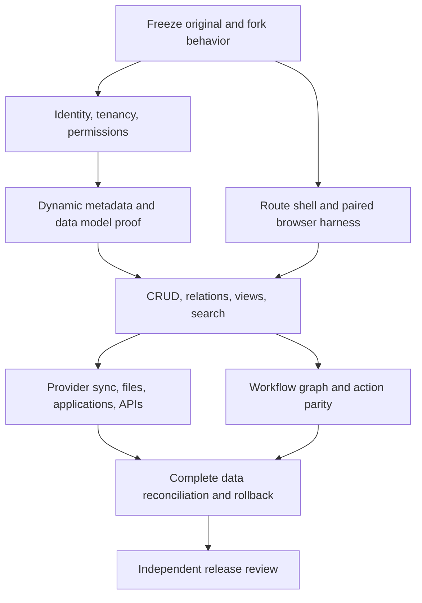

# Twenty migration maps

## At a glance

Replacing Twenty's stack risks losing behavior hidden behind metadata, permissions, providers, and external clients.
These maps connect existing capabilities to replacement responsibilities and acceptance checks.
For M1, actual Salesforce usage defines requirements; Twenty supplies reusable behavior and implementation references.
The [M1 contract](m1-contract.md) records company evidence gaps; its [mock contract](m1-mock-contract.md) supplies user-authorized synthetic expectations for local implementation.
The maps below retain the broader full-platform preservation scope; they do not make every Twenty capability an M1 requirement. No feature receives a parity pass from source inspection alone.

## Read the maps

| Map | Purpose |
| --- | --- |
| [Frontend](frontend-map.md) | Thirty capability groups, source links, and positive and negative scenarios |
| [Backend](backend-map.md) | Twenty-five capability groups, preservation contracts, and unresolved runtime placement |
| [Acceptance criteria](criteria-map.md) | Shared release gates, evidence requirements, migration rehearsal, and verification gaps |
| [Source coverage](source-coverage.json) | Individual routes, settings, flags, workflow actions, and core-object declarations |

The upstream baseline is local `upstream/main` at `a431f9afb6e761322109ea3b1b942e007b31eef2`.
The audited fork is `1bf3ec682fcc7b768d1ea895d1a39ec917299b5c`.
These are pinned local revisions, not a claim about today's remote upstream.
Capture both when distinguishing original Twenty behavior from Fenforce changes.

All replacement statuses start **unverified**.
The catalog contains 31 application routes, 103 settings routes, 16 flags, 20 workflow actions, and 34 object declarations.
Every catalog entry names its feature group and proposed positive and negative checks.
These 204 declarations do not enumerate every endpoint, field editor, operator, provider branch, or deployed configuration.
The broader maps group those areas; implementation starts by expanding the selected group's concrete contracts.
An enum declaration proves neither registration nor deployment availability.

## Supplementary capabilities

These groups cover surfaces outside the main frontend and backend tables.
Their replacement status is also **unverified**.

| ID | Capability and source | Target responsibility | Positive / negative acceptance |
| --- | --- | --- | --- |
| EXTRA-01 | [Client SDK](../../packages/twenty-client-sdk/package.json), [application SDK](../../packages/twenty-sdk/package.json), [Zapier](../../packages/twenty-zapier/src/authentication.ts), [companion](../../packages/twenty-companion/src/main/services/TwentyClient.ts) | Compatibility endpoints backed by authorized Convex operations; runtime placement remains unproven | Run each supported consumer version against both backends. Preserve schemas, authentication, pagination, uploads, and errors; reject revoked credentials. |
| EXTRA-02 | [Admin settings routes](../../packages/twenty-shared/src/types/SettingsPath.ts), [admin backend](../../packages/twenty-server/src/engine/core-modules/admin-panel/) | Cloudflare UI and restricted operational services; provider-specific controls need explicit replacements | Inspect users, workspaces, jobs, health, configuration, and AI administration with frozen fixtures. Deny non-admin direct calls and conceal secrets. |
| EXTRA-03 | [DPA backend](../../packages/twenty-server/src/engine/core-modules/dpa/), [application routes](../../packages/twenty-shared/src/types/AppPath.ts), [support](../../packages/twenty-front/src/modules/support/) | Cloudflare routes and persisted agreements where applicable | Open legal, community, and support destinations; preserve agreement version and actor. Reject unauthorized agreement changes and recover from unavailable destinations. |

## Target responsibilities

| Layer | Intended owner | Required proof |
| --- | --- | --- |
| Hosting and navigation | Cloudflare and TanStack Router | Deep links, redirects, history, and both UI surfaces |
| Styling and interaction primitives | Existing Linaria, Twenty UI and Base UI for M1 | [ADR 0002](../adr/0002-stylex-base-ui.md); build integration, visual review, keyboard behavior, themes, and RTL |
| Interface language | Retain Lingui through React and TanStack migration | [ADR 0001](../adr/0001-retain-lingui.md); catalogs, activation, fallback, translated errors, and AC-10 |
| Client server-state | TanStack Query with the Convex adapter | Reactive updates, optimistic rollback, pagination, revocation, and reconnect |
| Data and authorization | Convex | Shared code-defined field contracts, transactions, relations, tenant isolation, and the accepted permission matrix; runtime customization only if M1 evidence requires it |
| Domain operations | Effect v4 | Typed failures, bounded resources, cancellation, and serializable framework boundaries |
| Durable execution | Feishu for selected native human approval; other engines require a scoped decision | Fenforce authorization, immutable snapshots, verified approval state and replay-safe application; full workflow graph parity remains separate |
| Later experiments | Temporal and Convex Workflow | The same workload and failure fixtures before comparison |

This table records the agreed direction, not a verified compatibility assessment.
Effect does not replace database transactions or workflow persistence.
Cloudflare Workflows does not supply Twenty's workflow editor, permission model, or approval UI automatically.
Arbitrary user code and provider protocols need isolated-runtime decisions before implementation.
Do not remove legacy consumers merely because the replacement frontend uses Convex.

## Full-platform critical path



For M1 execution order and dependencies use [roadmap #1](https://github.com/fpcMotif/fenforce/issues/1) and the [blocked contract](m1-contract.md). The path below describes broader platform preservation, not pilot entry requirements.

1. Freeze fixtures, deployment flags, entitlements, supported clients, and measurable budgets before implementing each slice.
2. Prove identity and dynamic metadata before committing the rest of the application to a Convex schema design.
3. Migrate one complete route and its backend contract; retain the old path until paired checks pass.
4. Expand across capability groups, including external consumers and provider failure recovery.
5. Rehearse data migration, competing-writer control, and rollback after target writes.
6. Cut over only when every in-scope contract has accepted evidence and no unexplained difference remains.

The synthetic approval experiment is a technology probe, not a replacement for Twenty's complete workflow catalog.
It does not select the production human approval engine. The M1 native Feishu operation still needs business fields and approver policy.

## Working with agents

Follow the [development workflow](../agents/development-workflow.md).
The investigator expands one feature ID into concrete contracts and captures baseline fixtures.
The frontend and backend roles receive separate owned paths and the same contract IDs.
The coordinator owns schema, lockfile, dependency decisions, and integrated state.
The reviewer independently reproduces candidate results and checks baseline differences.
Do not assign the same shared checkout to concurrent writers without isolation.

Every handoff includes feature IDs, source revision, actor matrix, dependencies, owned paths, and acceptance evidence.
Runtime availability, source inventory coverage, and production parity remain separate facts.

## Check and maintain

From the repository root:

```sh
bun docs/migration/check-map.mjs
bun docs/migration/check-map.mjs --self-test
```

The checker detects missing declarations, changed catalog sources, broken local links, unknown feature IDs, and unsupported status claims.
It reads five explicitly declared enum catalogs; it does not discover every product behavior.
Update mappings deliberately after reviewing catalog changes; do not regenerate a blanket pass.
Grouped feature tables and detailed acceptance criteria remain human-reviewed documents.
Catalog entries stay unverified until their positive and negative contracts have paired, independently reviewed evidence.

For each verified entry, `evidence` contains both `positive` and `negative` scenario records.
Each record needs `result: "pass"`, full `sourceRevision` and `targetRevision`, and three repository-relative artifact paths.
Those paths are `baselineArtifact`, `candidateArtifact`, and `reviewArtifact`.
Artifacts contain the detailed evidence required by the criteria map.
The checker requires real Git commits and nonempty regular files inside the repository, including resolved symlink destinations.
The reviewer must assess evidence quality and applicable shared gates.
An entry's catalog status does not automatically change its feature group's status or authorize release.

"Same or better" requires preserved contracts plus measured improvement where claimed.
Do not copy a baseline defect: record its reproduction and an explicit correction criterion before implementing the fix.
Feature removal or unavailable replacement requires an explicit scope decision; it cannot silently become a passing result.
